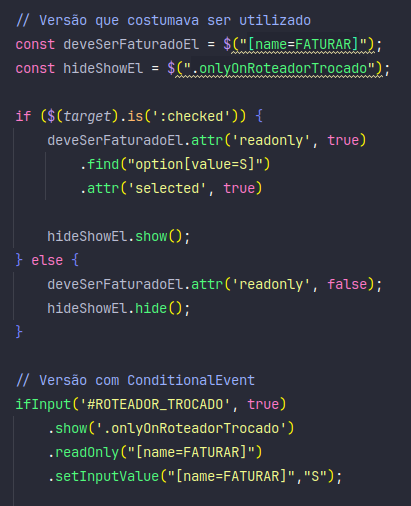

# ConditionalEvent (1)

**ConditionalEvent** was created to solve the problem of repetitive rewriting in form creation, where multiple functions are needed to trigger events only under certain conditions.

To address this, the **ConditionalEvent** class was developed, which includes a set of ready-to-use common events for forms. All events are triggered when a specific condition is met; otherwise, an opposite event is activated.

For example, the **Show** event displays the target if the condition is true and hides it if false.



## Example

```html
<div class="form-group mb-3">
            
    <div class="form-check">
        <input class="form-check-input" type="checkbox" onchange="ifInput(this,true).show('#teste1')"/>
        <label class="form-check-label">Shows input if "checked," hides it otherwise.</label>
    </div>

    <input class="form-control" id="teste1">
</div>

<div class="form-group mb-3">
    
    <div class="form-check">
        <input class="form-check-input" type="checkbox" onchange="ifInput(this,true).hide('#teste2')"/>
        <label class="form-check-label">Hides input if "checked," shows it otherwise.</label>
    </div>

    <input class="form-control" id="teste2">
</div>
```

## Methods

### Applying Conditionals

| **ifInput(input, valueRequired, debugMode)** | Applies a condition based on the input value |
| --- | --- |
| **ifCondition(condition, debugMode)** | Creates a condition for applying events |
| **ifNotEmpty(input, debugMode)** | Applies the condition that the input must not be empty |

### Events

| **show(target)** | Shows the target if the condition is true, hides it otherwise |
| --- | --- |
| **hide(target)** | Hides the target if the condition is true, shows it otherwise |
| **disable(target)** | Disables the target if the condition is true, enables it otherwise |
| **enable(target)** | Enables the target if the condition is true, disables it otherwise |
| **slideDown(target, duration)** | Slides down (shows) the target if the condition is true, slides up (hides) it otherwise |
| **slideUp(target, duration)** | Slides up (hides) the target if the condition is true, slides down (shows) it otherwise |
| **readOnly(target)** | Makes the target readonly if the condition is true, makes it readwrite otherwise |
| **readWrite(target)** | Makes the target readwrite if the condition is true, makes it readonly otherwise |
| **setInputValue(target, value, ifFalseReturnToOriginalValue)** | Sets the value on the target if the condition is true, reverts to the original value otherwise |
